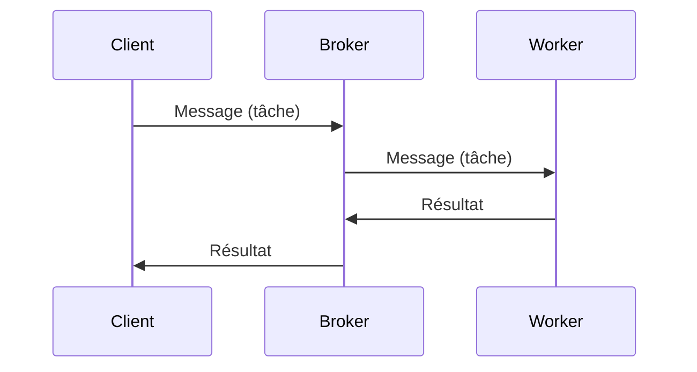

Créé le : 27/03/2023 | 09:22 
Tags : #Veilles #dev #python 
Lié : 

# Présentation de l'outil
*Celery* est un package python permettant de mettre en place un système de *file d'attente de tâches distribuées* exécutées par des *workers*. Le principe du système est de distribuer des tâches entre différentes machines pour permettre (entre autres) une mise à l'échelle verticale d'un système.

## Task
Les tâches sont ici des fonctions python. Ces fonctions sont généralement des fonctions qui sont longues à exécuter et peuvent être mises en arrière-plan. Ex : Téléchargement, traitement d'image, entraînement d'un modèle

## Queue / Message Broker
Une *liste de tâches*, c'est une liste composée d'un ensemble de messages représentants des tâches à exécuter.

On utilise généralement *Redis* ou *RabbitMQ* en tant que *broker* avec *Celery*, mais *Amazon SQS* (Simple Queue Service) et *Zookeeper* sont aussi supportés nativement.

## Workers
Les workers sont des *machines* (virtuelles ou non) qui surveillent la *liste* et exécutent ses *tâches*. Un worker exécutera les tâches une par une et pourra être configuré pour :
- N'exécuter que certains types de tâches
- S'attribuer un certain nombre de tâches à l'avance
- Être mis à l'échelle automatiquement en fonction de la demande

# Utilisation au sein de mon projet
## Présentation du projet
Histo-IA est une interface web permettant à des histologistes de quantifier des maladies dans des images de tissus.

Pour cela, on utilise des *pipelines de prédictions*, composées de modèles et d'étapes de pré et post processing. Ces *pipelines* sont souvent assez longues à exécuter, particulièrement lorsque le nombre d'images augmente.

## Contraintes
- Les processus exécutés (pipelines de prédiction) sont assez longs
- L'application doit rester disponible pendant une prédiction pour :
	- Montrer l'avancée des prédictions
	- Consulter l'historique des prédictions
	- Ajouter de nouvelles expériences à analyser dans la file d'attente

## Mise en place de *Celery*
Pour répondre à ces contraintes, j'ai utilisé *Celery*. Il a permis de :
- Faire en sorte que les longs processus de prédiction soient gérés par une autre partie que l'API
	- Laisser l'API disponible pendant une prédiction
- Paramétrer les workers pour qu'ils n'exécutent pas plus d'une tâche utilisant le GPU à la fois
- Mettre en place une liste des futures prédictions à exécuter
- Consulter l'avancement des prédictions 